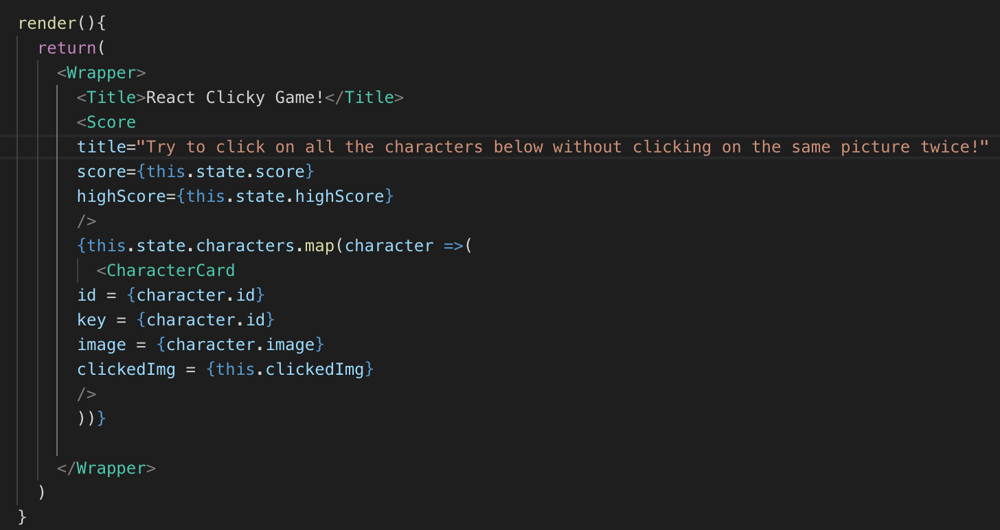
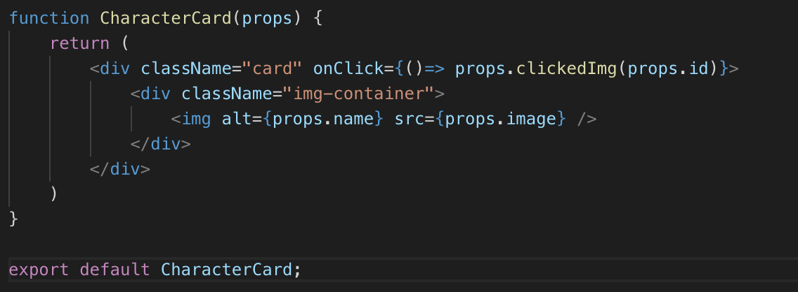
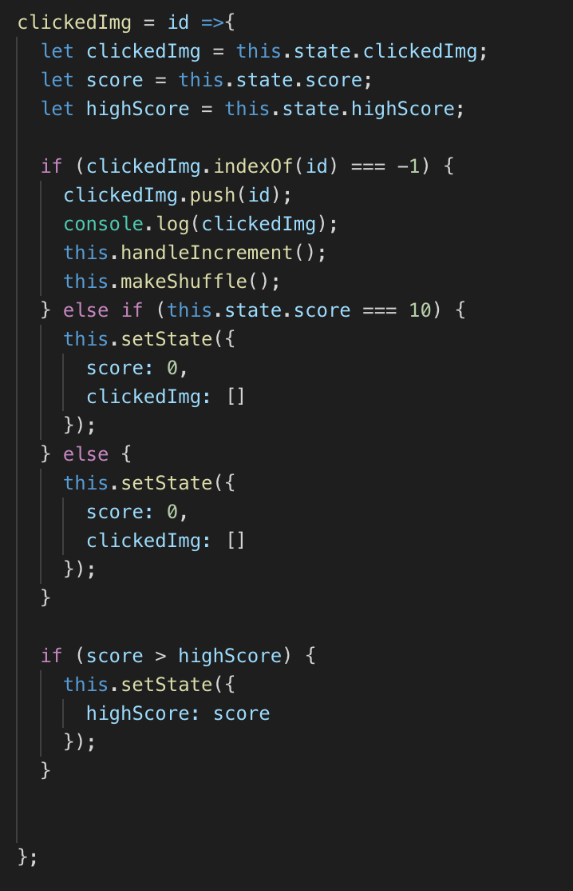
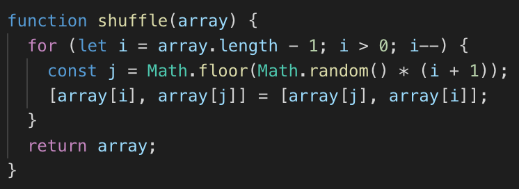

# React Click Game

## Overview
React-based web game where a user will attempt to click on the different pictures of characters without clicking on the same picture twice.

## Instructions 
The user will begin the game by clicking on any picture of the characters shown. After this, the pictures being rendered will shuffle positions and the user will try to click on a different picture without clicking on any picture they have already clicked on. While playing, the game will update their current score and their over high score. The game will reset if the user clicks on the same picture twice, or the user clicks all ten pictures correctly.

## Code Breakdown

* Render function in App.js that renders all components specified. Includes mapping over the array of characters and assigning each one to a card to be rendered.

* Example of a component. Card component that holds each image of a character. Also holds an id and includes an onClick function.

* Function that is stored in each character card that runs on click. When a new image is clicked, it is pushed into a clickedImg array. This function then checks each clicked picture to see if it has already been clicked. If a picture has not already been clicked, the images rendered are shuffled and the current score is updated. If a picture has already been clicked, the state of the score is set back to zero and the state of the clickedImg array is set back to empty.

* function that shuffles rendering of images.

## Technology 
* JavaScript
* React.js
* CSS
* GitHub Pages

## GitHub Repository
(https://github.com/wwhite12/react-game.git)

### Creator
William White